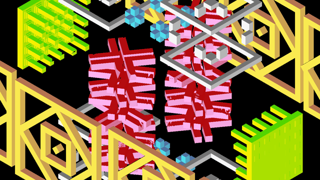

# Shader to C++ experiment

This prototype explores the manual translation of GLSL-like shaders from ShaderToy to C++. The goal is to define an empirical approach before considering a more automated solution (ie. GLSL -> SPIR-V -> JSON -> C++).  

Beyond the technical challenge, this project is also an exercise in **digital preservation**.  

## Why Convert GLSL Shaders to C++?  

Shaders from ShaderToy depend on WebGL, which itself relies on web browsers and GPU drivers. Given the commercial landscape as of year 2025, browsers are increasingly controlled by tech giants (well, Google actually), making WebGL's long-term survival uncertain. This approach also echoes early computer graphics history, as described in [Pierre Hénon's work](https://hist3d.fr/livre/) on French digital animation, when the rendering computer was separate from the display system.

## Next Steps?

1. Broaden the manual GLSL -> C++ conversion (or even to C ?)
1. Investigate automated conversion via SPIR-V
1. Compile a collection of preserved shaders

## Proof of concept

Below is the result [of a non-automated C++ translation](https://github.com/astrofra/toy-shader-cpp/blob/main/src/flopine.cpp) of [Flopine's Shadertoy](https://www.shadertoy.com/view/tttBRX) titled `Cubes are dancing` : 

